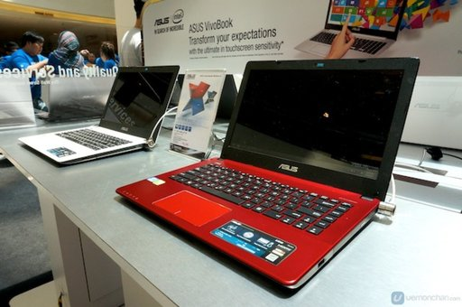
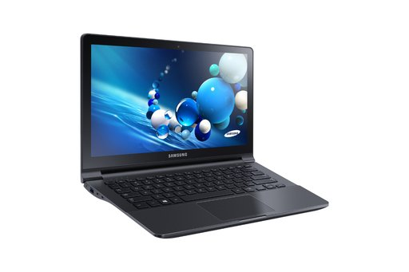
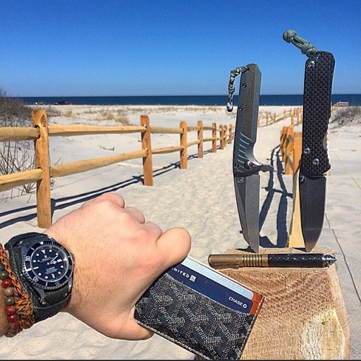
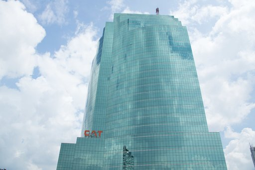
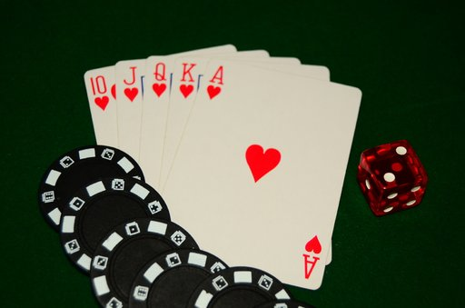

# OBSS AI Image Captioning Challenge - My Solution

This repository contains my submission and approach for the OBSS AI Image Captioning Challenge, part of the OBSS Deep Learning Internship Program (2025). The goal of the challenge was to generate descriptive captions for a diverse set of images.

## Overview

My solution utilizes the **Salesforce BLIP-2 OPT 2.7B model**, a powerful pre-trained vision-language model, for generating image captions. The approach focuses on zero-shot inference, meaning the model was used without any additional fine-tuning on the competition's training data. Key considerations were made for resource efficiency to run within the Google Colab Free Tier environment.

## Tech Stack

*   **Programming Language:** Python 3.11 (as per Google Colab environment)
*   **Core Libraries:**
    *   PyTorch (Version: `2.3.0+cu121`) <!-- Verify with torch.__version__ -->
    *   HuggingFace Transformers (Version: `4.41.2`) <!-- Verify with transformers.__version__ -->
    *   Pillow (PIL)
    *   Pandas
    *   Tqdm
*   **Model & Techniques:**
    *   **Model:** `Salesforce/blip2-opt-2.7b`
    *   **Processor:** `Blip2Processor`
    *   **Quantization:** 8-bit (via `BitsAndBytesConfig`)
    *   **Precision:** `torch.float16` for inference
*   **Environment:** Google Colab (Free Tier - NVIDIA T4 GPU)

## Approach

1.  **Model Loading & Optimization:**
    *   The BLIP-2 OPT 2.7B model was loaded from HuggingFace.
    *   To fit within the 15GB VRAM of the T4 GPU, 8-bit quantization was applied using `BitsAndBytesConfig`.
    *   Inference was performed using `torch.float16` precision.
    *   `device_map="auto"` was used for optimal layer distribution.

2.  **Image Processing & Caption Generation Pipeline:**
    *   Test images were loaded using Pillow and converted to RGB.
    *   The `Blip2Processor` was used to preprocess images and tokenize a standard text prompt.
    *   **Prompt:** A consistent prompt, `"a photo of"`, was used for all images to guide the caption generation.
    *   **Inference:** The `inputs` dictionary, containing the preprocessed `pixel_values` and tokenized `input_ids` (prompt), was moved to the CUDA device. The `pixel_values` were processed by the model in `torch.float16` precision as configured during model loading. The `model.generate()` method was then called with `max_new_tokens=50` to control caption length.
    *   **Post-processing:** Generated token IDs were decoded back to text using `processor.batch_decode()`, skipping special tokens.

3.  **No Fine-tuning:**
    *   Due to time and resource constraints, and to leverage the strong zero-shot capabilities of BLIP-2, no fine-tuning was performed on the provided training data.

## How to Run

1.  **Open in Colab:** Click the "Open In Colab" badge at the top of this README to open `submission.ipynb` directly in Google Colab.
2.  **Data:**
    *   The notebook expects the competition data to be uploaded or accessible. You will need to:
        *   Upload your `kaggle.json` API key when prompted by the first cell.
        *   Run the cells that download and unzip the `obss-intern-competition-2025.zip` dataset.
    *   Alternatively, manually upload and unzip the dataset ensuring the paths in the notebook (`obss_data/test/test/` for images and `obss_data/test.csv`) are correct.
3.  **Execution:**
    *   Run all cells in the notebook.
    *   The notebook will install necessary packages, load the model, process images, generate captions, and finally save the `submission.csv` file to the Colab environment.

## Sample Outputs

Below are some sample outputs from my pipeline.

**Strong Predictions:**

1.  **Image ID:** `100003.jpg`
   
    
    
    **Prediction:** `a photo of a red laptop on display at a store`
    **Comment:** This is a good, specific prediction. The model correctly identifies the color (red), the object (laptop), its status (on display), and the likely context (at a store).

3.  **Image ID:** `100007.jpg`
   
    
   
    **Prediction:** `a photo of a small airplane parked on the tarmac`
    **Comment:** This is a clear and accurate caption. It correctly identifies the type of aircraft (small airplane), its state (parked), and its location (on the tarmac), which matches the visual well.

5.  **Image ID:** `100019.jpg`
   
    
    
    **Prediction:** `a photo of a samsung notebook computer`
    **Comment:** This is a concise and accurate identification, correctly naming the brand (Samsung) and the type of device (notebook computer).

**Poor/Failure Cases (or areas for improvement):**

1.  **Image ID:** `100001.jpg`
   
    
   
    **Prediction:** `a photo of a person holding a knife on a beach`
    **Comment:** Partially correct but potentially misleading. The image shows a hand with a watch and wallet, with two large knives displayed upright in wood on a beach. "Person holding a knife" isn't entirely accurate as the knives are displayed, not actively held for use by the person whose hand is visible. The model focused on "knife" and simplified the scene.

3.  **Image ID:** `100005.jpg`
   
    
   
    **Prediction:** `a photo of a tall building with a sky background`
    **Comment:** Too generic. While true (it's a tall, modern glass building with a "CAT" logo), the caption lacks specificity regarding its reflective nature, modern architecture, or the visible logo.

5.  **Image ID:** `100013.jpg`
   
    
   
    **Prediction:** `a photo of poker chips and dice`
    **Comment:** Accurate but incomplete. The image shows a royal flush in hearts, poker chips, and a die. The caption identifies chips and dice but misses the very significant poker hand.

## Analysis of Model Performance

My model, utilizing the zero-shot capabilities of BLIP-2 OPT 2.7B, performs best on images with clear, unambiguous subjects and common, well-defined scenes, especially when they align well with the "a photo of" prompt. For instance, images featuring distinct consumer electronics in a store setting like the red laptop in `100003.jpg`, typical outdoor scenes such as airplanes on a tarmac (`100007.jpg`), or specific products like the Samsung notebook (`100019.jpg`) generally yield accurate and descriptive captions. This strength stems from BLIP-2's extensive pre-training on a diverse range of general visual concepts. The model also demonstrates a reasonable ability to identify and attempt to transcribe text within images, as seen with the cross-stitch (`100004.jpg` - not shown as sample but was reviewed) and the billboard (`100000.jpg` - not shown as sample), even if precision in text transcription can vary.

The model struggles or produces suboptimal captions in several scenarios. Firstly, when an image contains multiple prominent objects or a complex scene, the model might oversimplify or focus on only one aspect. This was observed with `100001.jpg` (focusing on "knife" despite other significant items) or `100013.jpg` (missing the crucial detail of the poker hand). Secondly, captions can be too generic for images that, while depicting a common subject, have more specific details that could be captured (e.g., `100005.jpg` - "a tall building"). This tendency towards broader descriptions is a common limitation of zero-shot captioning. The fixed prompt "a photo of" might also constrain the model if the image content is not a literal photograph. Without fine-tuning, the model relies on its generalized knowledge, which may not always capture all nuances. Occasional repetitive token generation was also observed on some more challenging images outside this sample set (e.g., `100621.jpg` which produced repetitive "spice" tokens).

## Files in this Repository

*   `submission.ipynb`: The Jupyter Notebook for model loading, inference, and submission generation.
*   `report.pdf`: The detailed participant report (this document in PDF format).
*   `submission.csv`: An example output CSV file generated by the notebook. *(You can choose to commit this or let users generate it themselves)*
*   `sample_images/`: Directory containing the sample images used in this README.
*   `README.md`: This file.

## Acknowledgements

*   Salesforce for the BLIP-2 model.
*   HuggingFace for the Transformers library and model hosting.
*   The Open Images Dataset V7, from which the competition dataset was derived.
